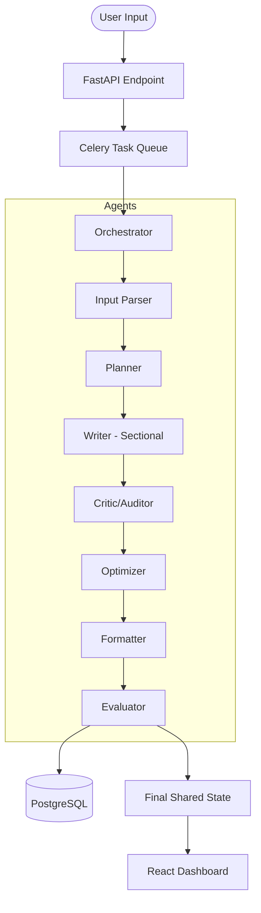

# System Architecture: Content Agent System

## Overview

This system uses a **Sequential Multi-Agent Pipeline** to transform raw user intent into high-quality, formatted, and evaluated content. It is built for **reliability**, **determinism**, and **observability**.

## The Pipeline Flow (Mermaid)

## Technical Decisions

1. **Pydantic Data Contracts**: Every agent communicates via strictly defined Pydantic models. This prevents the common "unstructured output" failures in LLM systems.
2. **Sectional Generation**: The Writer agent breaks the outline into pieces and writes them individually. This maintains high context focus and reduces hallucinations compared to long-form generation.
3. **Critic-Optimizer Loop**: Instead of a simple "one-shot" generation, we use an auditor-editor pair. The Critic identifies flaws without rewriting, and the Optimizer implements fixes surgically.
4. **Resilience**: Every LLM call is wrapped in exponential backoff retries to handle rate limits or transient API blips.
5. **Observability**: Every agent appends its internal reasoning and status to a global `logs` array, which is visualized in a terminal-style UI on the frontend.

## Tech Stack

- **Backend**: Python, FastAPI, Celery, Redis, SQLAlchemy.
- **Frontend**: React, TypeScript, Tailwind CSS, Framer Motion.
- **Testing**: Pytest.
- **CI/CD**: GitHub Actions.
