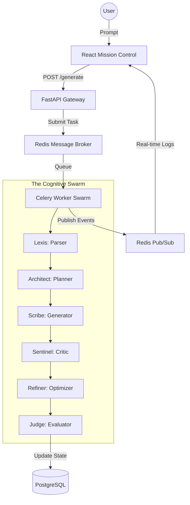

# 🌌 ORION: Distributed Neural Orchestration Platform


**Orion** is a state-of-the-art intelligence synthesis engine designed to demonstrate the power of **multi-agent collaborative orchestration**. Unlike traditional single-prompt AI tools, Orion utilizes a distributed swarm of 6 specialized cognitive nodes to deconstruct, plan, synthesize, and validate high-density intellectual assets.

---

## 🏛 System Architecture

Orion is engineered for resilience and zero-latency observability. It follows a **Decoupled Orchestration Pattern**, separating the user interface from the heavy cognitive execution layer.



---

## 🚀 Key Engineering Pillars

### 📡 Real-Time Swarm Observability (WebSockets)
Orion features a high-fidelity **WebSocket & Redis Pub/Sub** architecture. As the agents progress through the cognitive phases, low-level kernel logs and system states are streamed instantly to the frontend. This provides a "God-eye view" of the system's low-level orchestration logic.

### 🧠 Additive State Management
The platform utilizes an **Additive Shared State** model. Every agent receives the full context of previous agents but is only permitted to modify its designated namespace. This ensures:
- **Traceability**: You can audit exactly what the 'Architect' planned vs what the 'Scribe' wrote.
- **Validation**: The 'Judge' agent can verify the output against the original 'Parser' requirements.
- **Resilience**: Task state is persisted in Redis and PostgreSQL, allowing for interrupted pipelines to be resumed without loss of data.

### 🔊 Tactical UI Haptics (Synthetic Audio)
To elevate the user experience, Orion includes a programmatic **Synthetic Audio Engine** built on the **Web Audio API**. By generating high-frequency tech chirps and pulse waves directly in the browser, the platform provides immersive feedback for agent transitions without relying on external binary assets.

---

## 🛠 The Technical Stack

### Backend (The Brain)
- **FastAPI**: Asynchronous Python framework handling mission routing and task ingestion.
- **Celery & Redis**: Distributed task queue management ensuring the UI remains responsive during heavy LLM synthesis.
- **PostgreSQL**: Enterprise-grade persistence for the Intelligence Archive.
- **Pydantic V2**: Strict data validation for complex agent inter-communication.

### Frontend (Mission Control)
- **React 19 & Vite**: Ultra-fast build tooling and state-of-the-art UI lifecycle management.
- **Tailwind CSS v4**: Utility-first design system implementing a premium **"Professional Noir"** aesthetic.
- **Framer Motion**: Smooth, high-performance micro-animations for state transitions and data visualization.
- **Lucide Icons**: Crisp, tactical iconography for system observability.

---

## 🤖 The Swarm Protocols

Each agent in the Orion swarm is fine-tuned for a specific cognitive function:

1.  **Lexis (Linguistic Parser)**: Deconstructs raw human directives into atomic semantic requirements.
2.  **Architect (Structural Strategist)**: Synthesizes logical blueprints and hierarchical narrative frameworks.
3.  **Scribe (Core Generator)**: Transforms blueprints into high-density, technically accurate text.
4.  **Sentinel (Quality Auditor)**: Mercilessly audits for factual integrity, tone, and logical consistency.
5.  **Refiner (Semantic Polisher)**: Reduces linguistic entropy, elevating vocabulary and sharpening conceptual clarity.
6.  **Judge (Statistical Evaluator)**: Quantifies the final output against 6 core cognitive metrics (Depth, Clarity, etc.).

---

## ⚡ Setup & Deployment

### Environment Configuration
Create a `.env` file in the root:
```env
GROQ_API_KEY=your_key
NVIDIA_API_KEY=your_key
POSTGRES_USER=postgres
POSTGRES_PASSWORD=your_password
REDIS_HOST=localhost
```

### Execution Protocol
1.  **Start Services**: Ensure Redis and PostgreSQL are active.
2.  **Initialize DB**: `python backend/init_db.py`
3.  **Launch API**: `uvicorn app.main:app --reload`
4.  **Launch Workers**: `celery -A app.worker.tasks worker --loglevel=info`
5.  **Launch Dashboard**: `npm run dev`

---

## 🎓 Why This Matters (For Interviewers)
Orion is not just an AI wrapper; it is an **Orchestration Framework**. It solves real-world engineering challenges:
- **Asynchronous Scalability**: Handling long-running LLM tasks without blocking the main event loop.
- **Real-Time Distributed Communication**: Managing state across decoupled services via WebSockets.
- **State Persistence & Auditability**: Ensuring AI behavior is transparent, traceable, and persistent.
- **High-Fidelity Frontend Engineering**: Implementing modern React patterns and custom browser API integrations.

---

<div align="center">
  <sub>Developed by **Nikil R** // ORION NEURAL ENGINE © 2026</sub>
</div>
